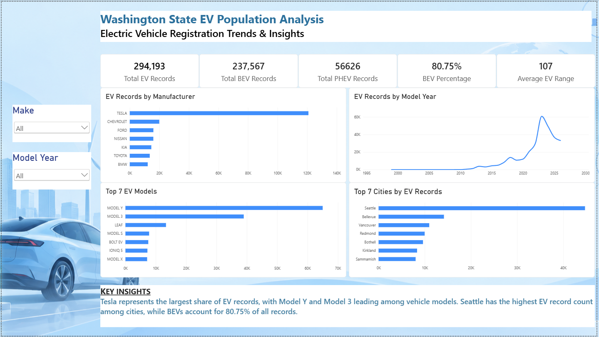
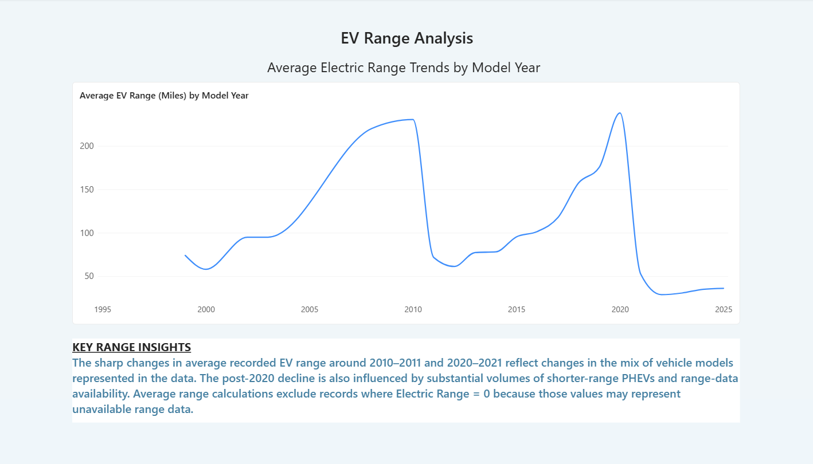

# Washington State EV Population Analysis

## Project Overview

This project analyzes Washington State electric vehicle population data using SQL and Power BI. The analysis explores EV adoption trends, leading manufacturers and models, geographic distribution, vehicle types, and recorded electric range.

The project demonstrates an end-to-end analytics workflow including data exploration, SQL analysis, data transformation, DAX measures, and interactive Power BI dashboard development.

## Dashboard Preview

### EV Population Overview



### EV Range Analysis



## Key Insights

- The dataset contains **294,193 EV records**.
- **237,567 records are BEVs**, representing approximately **80.75%** of the dataset.
- **56,626 records are PHEVs**.
- Tesla represents the largest share of EV records in the dataset.
- Model Y and Model 3 are the leading vehicle models by record count.
- Seattle has the highest EV record count among cities in the dataset.
- Average recorded electric range is approximately **107 miles** when records with an Electric Range of 0 are excluded.
- Electric range trends vary significantly by model year and are influenced by vehicle mix and range-data availability.

## Tools & Technologies

- MySQL
- SQL
- Power BI
- Power Query
- DAX

## SQL Analysis

SQL was used to explore and analyze the EV population dataset, including:

- Data profiling and missing-value checks
- Aggregation with `COUNT`, `AVG`, `GROUP BY`, and `HAVING`
- Common Table Expressions (CTEs)
- Window functions
- `RANK()` and `PARTITION BY`
- Manufacturer and model ranking
- Top models within each manufacturer

## Power BI Dashboard

The interactive Power BI dashboard includes:

- Total EV, BEV, and PHEV KPI cards
- BEV percentage
- Average recorded EV range
- EV records by manufacturer
- EV records by model year
- Top EV models
- Top cities by EV records
- Make and model-year slicers
- Electric range trend analysis

## Repository Structure

```text
EV-Population-Analysis/
├── README.md
├── EV_Population_Analysis_Dashboard.pbix
├── dashboard_overview.png
├── range_analysis.png
└── sql/
    ├── 01_data_exploration.sql
    ├── 02_ev_analysis.sql
    └── README.md
